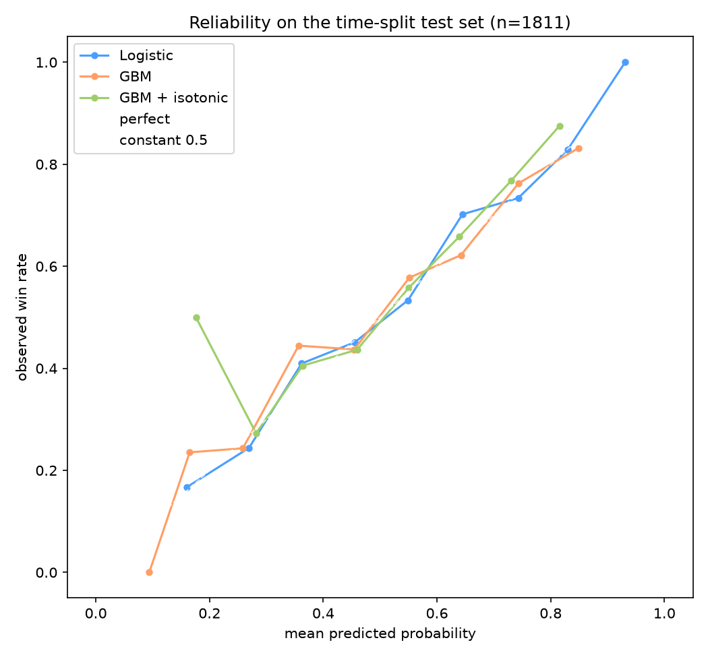

# CS2 Match Analytics

[](https://github.com/IlliaDol/cs2-match-analytics/actions/workflows/ci.yml)

A from-scratch probabilistic model of professional CS2 match outcomes — Elo baseline,
calibrated logistic/GBM, Bayesian team ratings, validated walk-forward — built as a
walkthrough of the whole data-science stack.



## Results

Time-split test set (train < 2026-01-01, n = 1,811 series). Lower logloss is better;
`constant_0.5` = always predict 0.5 (logloss ln 2 = 0.6931) — the floor every real
model must beat, shown on purpose.

| model | logloss | brier | acc | ece |
|---|---|---|---|---|
| **lr** (Elo diff + form/rest/h2h) | **0.6464** | 0.2278 | 0.6190 | 0.0242 |
| elo_k32 (from-scratch engine) | 0.6472 | 0.2282 | 0.6179 | 0.0251 |
| gbm | 0.6511 | 0.2298 | 0.6218 | 0.0255 |
| gbm_isotonic | 0.6560 | 0.2321 | 0.6102 | 0.0190 |
| constant_0.5 | 0.6931 | 0.2500 | 0.5721 | 0.0721 |
| dl_embedding (PyTorch) | 0.6632 | 0.2349 | 0.6052 | — |

Reads: a from-scratch Elo engine gets 0.647; adding form/rest/head-to-head features to a
logistic model edges it to 0.646; the deep-learning variant *loses* to logistic — at this
data size the signal is linear-ish in Elo space, and that honest negative is a finding.
Bayesian ratings (PyMC Bradley-Terry, `outputs/bayesian_ratings.csv`) quantify what Elo
cannot: per-team uncertainty.

## Method

- **Data:** 9,920 professional CS2 series (2023–2026, 3 tiers) from Kaggle; winners
  verified against map-level evidence and two real Major finals.
- **Elo:** the update rule derived as one SGD step on logistic log-loss; replayed
  time-ordered with pre-match ratings only (K-sweep peaks at K=32).
- **Features:** strictly pre-match — Elo gap, rolling 5-series form, rest days,
  head-to-head share, format flag; a leakage guard rejects any post-outcome column.
- **Model:** logistic regression vs gradient boosting vs a team-embedding MLP, all on a
  fixed time split; isotonic calibration tested and honestly reported as a negative.
- **Calibration:** reliability diagrams, ECE, Brier decomposition; drift monitored via
  monthly PSI on the Elo gap.

## Limitations

- No market odds: the v1-subset of bookmaker odds is too small for the model-vs-market
  chart, so calibration is vs *outcomes* only.
- Bo1s are a different regime (map-veto-free); the format flag helps but doesn't fully
  capture it — and the Bo1/Bo3 scatter shows format specialists exist.
- Roster/stand-in information sits unused in the raw data (per-map lineups) — the next
  feature family with the most upside.
- Tier-3 forfeit noise: ~1.5% of map rows carry unreliable winner flags; 2 corrupt
  series rows were dropped rather than repaired.
- Predictions are symmetric-by-construction but calibrated only on the aggregate —
  per-regime calibration (Bo1 vs Bo3, tier) is untested.

## Reproducibility

```bash
pip install -e ".[dev]"
# data (manual, git-ignored): download the Kaggle CSVs into data/raw/ — see DATA.md
python scripts/build_interim.py                        # series table
"C:/Program Files/R/R-4.6.1/bin/Rscript.exe" r/01_wrangle.R   # + 02, 03 (M3 inference/plots)
python scripts/build_features_v1.py                    # feature store (parquet)
python -m cs2analytics.models.train                    # artifacts + MLflow run
python -m cs2analytics.serve.monitor                   # drift report
```

The analysis notebooks (`notebooks/`) run top-to-bottom with `jupyter execute` and
produce every chart/table in `outputs/`. Tests: `pytest -q` (contract tests skip
automatically where data/artifacts are absent, so CI is green without the private data).

## Going deeper

- [`notebooks/07_break_effect_did.ipynb`](notebooks/07_break_effect_did.ipynb) — does a
  ≥30-day break hurt a team's next match? A DiD with three specifications; the naive
  "rust" story is **not** supported, selection into breaks dominates.
  Results: [`outputs/m13_did_results.csv`](outputs/m13_did_results.csv).
- [`r/04_rating_forecast.R`](r/04_rating_forecast.R) — Holt's linear trend vs a naive
  random walk on monthly Elo: the random walk wins for all 10 teams (ratings are
  near-martingale). Results: [`outputs/rating_forecast_metrics.csv`](outputs/rating_forecast_metrics.csv).
- [`docs/DECISIONS.md`](docs/DECISIONS.md) — every design decision a reviewer would
  question, one line each.

## Data & ethics

Match data comes from a public Kaggle dataset (git-ignored here; see DATA.md for schema
and the documented quirks, including a broken winner flag caught by cross-checking two
Major finals). This project is a **calibration study**: it measures how well
probabilistic models can predict outcomes and how honest their uncertainty is. It is
not betting advice; nothing here should be used to place wagers, and the repo takes no
position on gambling.