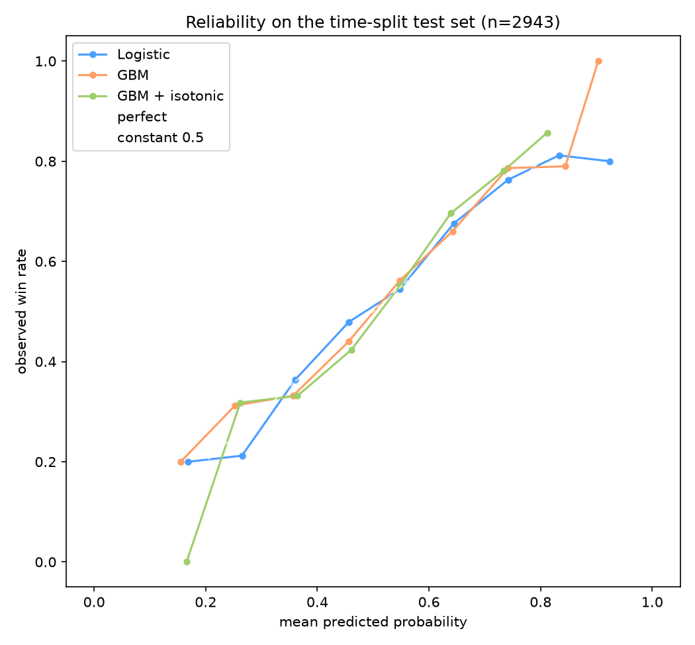

# How to read the reliability diagram

`outputs/fig_calibration.png` — the calibration chart this project is built around. Written
because the axes confuse almost everyone the first time: neither one is a score, and neither
one says whether a prediction was "right".

## The question it answers

The models output a **probability**, not a verdict: "team1 wins with probability 0.63".
A probability is easy to produce and hard to trust. A reliability diagram asks the only
question that matters about one:

> When the model says 40%, does it actually happen 40% of the time?

Binary outcome here: team1 wins, or team2 wins. 1,811 test matches.

## How each axis is built

1. Score every test match → 1,811 numbers between 0 and 1.
2. Sort them and cut into **10 equally-populated groups** (`reliability_table(..., bins=10)`).
3. For each group compute two things:
   * **X** = the mean of the predicted probabilities in that group — what the model promised.
   * **Y** = the fraction of those matches actually won — what happened.
4. Plot one point per group. Note that each point stands for **~181 matches**, not one.

Worked example from the figure: the blue point at **x ≈ 0.36, y ≈ 0.41** means "in the group
where the model averaged 36%, the team actually won 41%".

## Why both axes run 0 → 1

Because both are probabilities — X is what was *said*, Y is what *occurred*. A flawless model
would have X = Y everywhere, so every point would sit on the diagonal labelled **perfect**:

| where the point sits | what it means |
|---|---|
| on the diagonal | honest: promised 40%, delivered 40% |
| **above** it | the model **under**-estimated — reality beat the promise |
| **below** it | the model **over**-estimated — reality fell short |

The points are ordered left→right by predicted probability, so a sane curve **rises**:
matches it called 20% are won rarely, matches it called 80% are won often. A curve that does
not rise means the probabilities are close to random.

## What the three lines are

| line | model | shape |
|---|---|---|
| **Logistic** (blue) | logistic regression on Elo | tracks the diagonal closely |
| **GBM** (orange) | gradient boosting | also close, with a visible miss at the bottom (x ≈ 0.12 → y ≈ 0.0) |
| **GBM + isotonic** (green) | the same GBM with a post-hoc isotonic recalibration | pulled toward the diagonal, but breaks at the low end |
| **perfect** | the diagonal itself | a reference, not a model |
| **constant 0.5** | predicting 0.5 for everything | the baseline — a single point at x = 0.5, y = the base win rate |

## The anomaly at the left edge, and what it proves

The green line jumps to **y ≈ 0.50 at x ≈ 0.15**, then falls to ≈ 0.27. That is not a
plotting bug — it is what isotonic regression does. To stay monotonic it pools the rare,
very-low-probability matches into one block averaging ≈50%, which **destroys the distinction
at the low end**.

Measured in `notebooks/03_model_experiments.ipynb`:

    GBM logloss 0.6511 -> isotonic 0.6560     worse  (lower is better)
    GBM ECE     0.0255 -> isotonic 0.0190     better

* **logloss** grades the predictions themselves — how good they are.
* **ECE** (Expected Calibration Error) grades their honesty — the average gap from the diagonal.

So isotonic buys honesty (ECE) at the cost of sharpness (logloss). That is the
**honest negative** the README reports for isotonic, and this figure is the evidence. An ECE
of ≈0.02 means the stated probability is off by about **2 percentage points** on average,
which is why calibrated uncertainty can be claimed as a real result rather than a hope.

## How to regenerate it

The figure is produced by `notebooks/03_model_experiments.ipynb` (cells using
`cs2analytics.evaluation.calibration.reliability_table`). Run the notebook; it writes
`outputs/fig_calibration.png` at 150 dpi.
